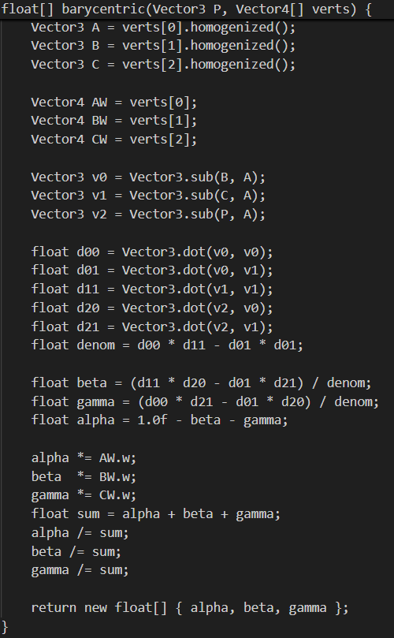
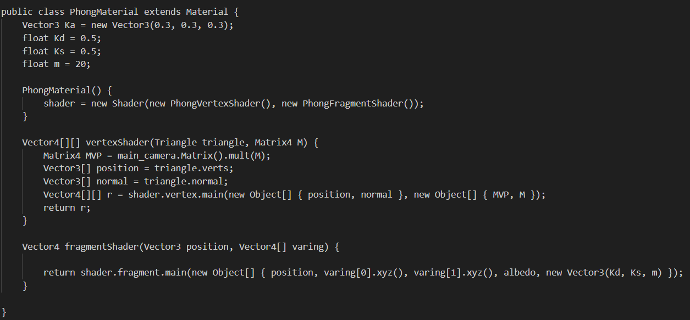
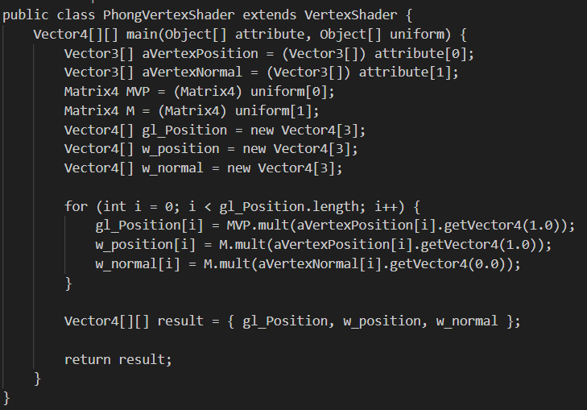
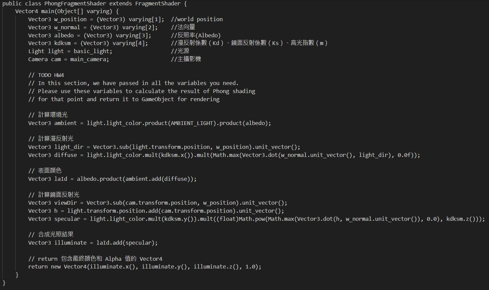

# ComputerGraphics_Lab4

## Barycentric Coordinates
P=αA+βB+γC  
α+β+γ=1  
Compute Barycentric Coordinate and store in alpha, beta, gamma  
Then apply Perspective Correction  
  

## Phong Shading
### PhongMaterial 
Pass parameter for the PhongVertexShader:  
triangle vertices, normals, and transformation matrices  
  
Pass parameter for the PhongFragmentShader to compute lighting for each pixel:  
Ka(ambient reflectivity), Kd(diffuse reflectivity), Ks(specular reflectivity), m(shininess coefficient), and albedo  
  

### PhongVertexShader
Calculate the position in screen space (gl_Position) and the position in world space (w_position)  
Then transform each vertex's normal vector to world space (w_normal)  
  

### PhongFragmentShader
Calculate ambient light and diffuse light  
Multiply the albedo by the ambient light and diffuse light to handle the surface color  
Calculate specular light and produce the final lighting result  
  

